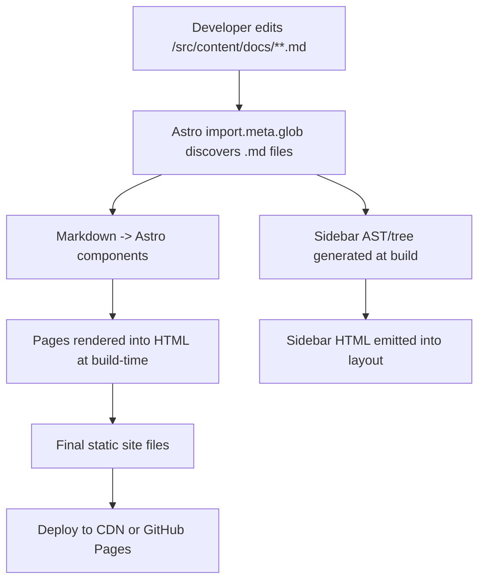
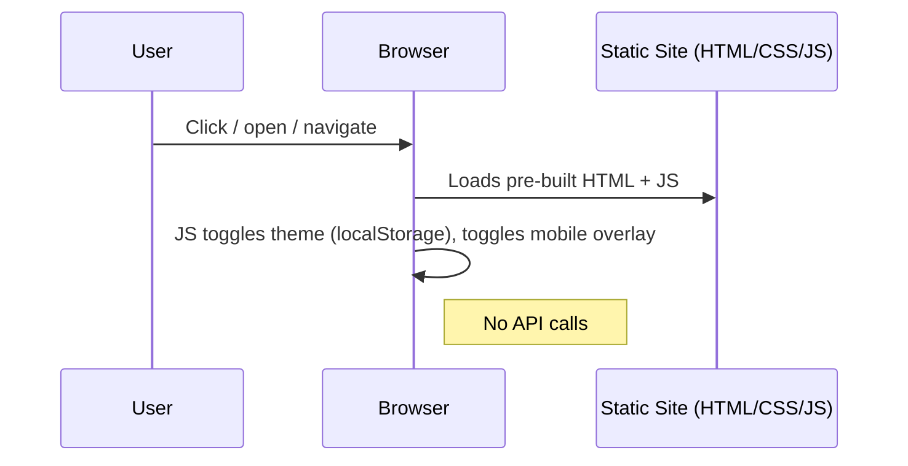

# Project Journey — Markdown Docs Engine

This document explains the tech stack, how to set up the project from GitHub, which files implement which features, how the pieces communicate, architecture diagrams, and how to package the site as Android, iOS and Windows apps.

## Quick summary

- Tech: Astro (static-first), Markdown, Tailwind (CDN), minimal JS.
- Source-of-truth: `src/content/docs/` — add folders & `.md` files and the site updates automatically at next build.
- No backend, no runtime API — everything is resolved at build-time via `import.meta.glob()`.

---

## Tech stack

- Astro — static site generator, file-based routing.
- Markdown — content format; frontmatter supported.
- Tailwind CSS (via CDN) — utility-first styles and `@tailwind/typography` concepts (we use the CDN for quick start).
- Vanilla JavaScript — small client scripts for theme toggle and mobile sidebar.
- Capacitor (recommended) — to wrap the site into native Android/iOS WebView apps.
- Tauri or Electron — to package as a Windows desktop app (Tauri recommended for smaller app size).

---

## Repository layout (important files)

- `package.json` — scripts: `dev`, `build`, `preview`.
- `astro.config.mjs` — Astro configuration.
- `src/layouts/BaseLayout.astro` — top-level layout: loads Tailwind CDN, includes `Navbar` and `Sidebar`, places content.
- `src/components/Navbar.astro` — header with dark-mode toggle and mobile menu logic (localStorage + DOM class).
- `src/components/Sidebar.astro` — server-side sidebar builder. Uses `import.meta.glob('/src/content/docs/**/*.md', { eager: true })` to discover markdown and build a nested tree.
- `src/pages/docs/[...slug].astro` — catch-all docs route that maps a URL to a discovered markdown module and renders it in the layout.
- `src/content/docs/` — Markdown content. Folder == sidebar section. `index.md` acts as the folder landing page.
- `src/styles/global.css` — small custom CSS + variables loaded by `BaseLayout` (Tailwind loaded via CDN).
- `README.md` and `PROJECT_JOURNEY.md` — docs and developer guide.

---

## How features map to files and how they communicate

- Sidebar generation (build-time)
  - Implemented in `src/components/Sidebar.astro`.
  - It uses `import.meta.glob` to read all markdown modules at build time. This produces a map of file paths -> modules (which contain `frontmatter` and compiled HTML when using Astro's Markdown integration).
  - The component converts file paths to routes and builds a nested tree of sections → pages.

- Page rendering (runtime in browser but resolved at build)
  - Implemented in `src/pages/docs/[...slug].astro`.
  - On route load Astro has already compiled `.md` files into components; this route chooses the proper component by matching the computed route string to the module discovered earlier and renders it inside `BaseLayout`.

- Theme (dark mode)
  - Implemented in `src/components/Navbar.astro` (client-side script).
  - Uses `localStorage` to persist theme and toggles the `class` on `document.documentElement` to enable Tailwind's `dark:` variants.

- Mobile sidebar
  - Minimal DOM-injected overlay created by `Navbar.astro`'s client script which clones the sidebar HTML when requested. Lightweight and works without additional state management libraries.

Communication summary:

- All content discovery happens at build-time (Astro + Vite). There are no API calls. Sidebar → pages communication is purely path-based: file path → route mapping.
- Runtime interactions are small and local to the client: theme toggle uses localStorage and DOM; mobile menu uses DOM insertion/removal.

---

## Mermaid: architecture diagrams

Build-time flow (what happens when you run `npm run dev` / `astro build`):



Runtime interaction (client-side):



Cross-platform packaging overview (how to turn the static site into mobile/desktop apps):

```mermaid
graph LR
  WebApp[Astro static site]
  WebApp -->|build web| Dist[dist/ (static assets)]
  Dist -->|Capacitor| Android(App)
  Dist -->|Capacitor| iOS(App)
  Dist -->|Tauri/Electron| Windows(App)
```

---

## Setup: clone and run (first-time from GitHub)

Prerequisites (developer machine):

- Node.js (LTS recommended; 18.x or 20.x are common). Verify with `node -v`.
- npm (bundled with Node) or pnpm/yarn if you prefer.
- Git.

Optional for native builds (see platform sections):

- Android: Android Studio (SDK + platform-tools + Java JDK 11+)
- iOS: Xcode (macOS only)
- Windows: Visual Studio / Rust toolchain if using Tauri

Clone and start dev server (PowerShell):

```powershell
git clone https://github.com/<your-org>/<repo>.git
cd "d:\delete me later\blog"
npm install
npm run dev
```

Open http://localhost:3000. Edit files in `src/content/docs/` and the sidebar will show the new content after rebuild.

Build for production:

```powershell
npm run build
npm run preview
```

deploy: Upload the `dist/` (Astro's output) to any static host (Cloudflare Pages, GitHub Pages, Netlify, Vercel).

---

## How to add content (author flow)

1. Create a folder under `src/content/docs/`, e.g. `src/content/docs/tutorials/new-feature/`.
2. Add `index.md` for the folder landing page and additional `.md` files for subpages.
3. Optionally add `title: Your Title` to the frontmatter to control the sidebar label.
4. Rebuild or save while running `npm run dev` to see live updates.

Filename -> route mapping rules used by the project:

- `src/content/docs/getting-started/index.md` -> `/docs/getting-started`
- `src/content/docs/guides/advanced.md` -> `/docs/guides/advanced`

Index files behave as folder defaults.

---

## Packaging as Android & iOS apps (Capacitor) — recommended path

Why Capacitor? It's a very small, modern wrapper that hosts your web app inside a native WebView and provides access to native APIs if needed.

High-level steps:

1. Build your web site:

```powershell
npm run build
```

2. Install Capacitor (project root):

```powershell
npm install @capacitor/core @capacitor/cli --save
npx cap init docs-engine com.example.docsengine
```

3. Add platforms:

```powershell
npx cap add android
# (on macOS) npx cap add ios
```

4. Copy web assets and open the native IDE:

```powershell
npx cap copy
npx cap open android
# (on macOS) npx cap open ios
```

5. From Android Studio / Xcode build and run on devices or simulators.

Notes:
- iOS builds require a macOS machine with Xcode and proper signing certificates/provisioning profiles.
- For Play Store/App Store release you must prepare icons, splash screens and follow each store's publishing flow.

---

## Packaging as a Windows desktop app

Two common options: Tauri (preferred for small footprint) or Electron (more mature ecosystem).

Tauri (recommended):

1. Install Rust and Tauri prerequisites (follow Tauri docs). On Windows you'll need Visual Studio Build Tools.
2. Add Tauri to the project and follow a high-level flow:

```powershell
npm run build
npm install -D @tauri-apps/cli
npx tauri init
npx tauri build
```

Electron (alternate):

1. Create a small `electron-main.js` that serves the `dist/index.html` and packages with `electron-builder`.
2. Add `electron`, `electron-builder`, configure `package.json` `build` settings, then use `electron-builder` to produce Windows installers.

Notes on native packaging:
- Desktop packaging may require additional code to handle file system paths and packaged asset loading.
- Tauri is leaner but requires installing Rust and understanding the native build toolchain.

---

## CI/CD & Distribution notes

- Static site hosting: Cloudflare Pages / Netlify / Vercel are easy and match the static nature.
- Mobile/desktop builds should be done in dedicated CI runners (macOS for iOS builds). Use GitHub Actions or other CI to produce signed artifacts.

---

## Next steps & recommended improvements

- Add frontmatter fields: `order` and `description` to control sidebar sorting and short summaries.
- Implement active-link highlighting in `Sidebar.astro` (compare current route with link href).
- Replace the mobile overlay with a small accessible off-canvas component for better UX.
- Add search: client-side (Lunr/JsSearch) or third-party (Algolia). For big docs, build an index at build-time.
- Swap CDN Tailwind for local build if you want full control over Tailwind version and plugins.

---

If you'd like, I can now:

- Add `order` frontmatter support and sorting for the sidebar.
- Implement active-route highlighting in the sidebar.
- Add a small `capcitor/` README and example config + icons to make mobile packaging easier.

Tell me which one you want and I will implement it next.
