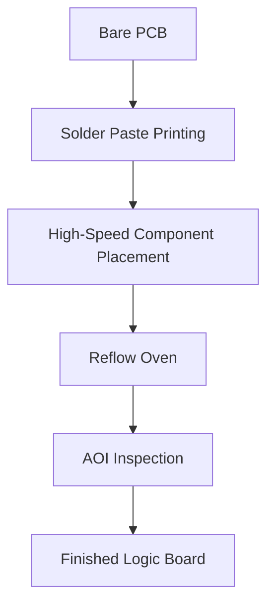
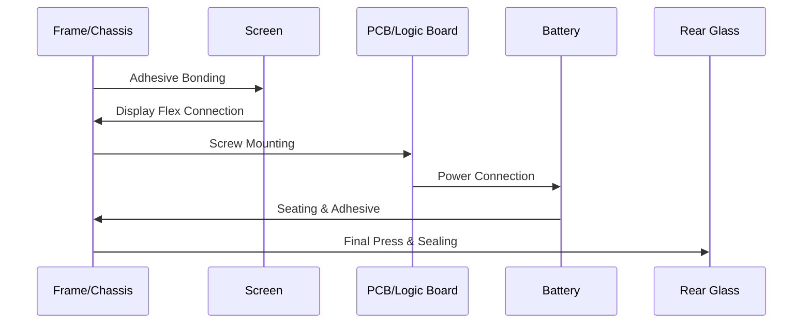

This guide provides a comprehensive technical breakdown of the assembly process for modern Android smartphones, from individual component preparation to final packaging.

---

# 📱 Android Smartphone Assembly Blueprint

## Table of Contents

* [1. Phase One: SMT & PCB Fabrication](https://www.google.com/search?q=%23phase-one)
* [2. Phase Two: Sub-Assembly & Preparation](https://www.google.com/search?q=%23phase-two)
* [3. Phase Three: Main Line Assembly](https://www.google.com/search?q=%23phase-three)
* [4. Phase Four: Testing & Quality Control](https://www.google.com/search?q=%23phase-four)
* [5. Phase Five: Final Packaging](https://www.google.com/search?q=%23phase-five)

---

## 1. Phase One: SMT & PCB Fabrication 

The "brain" of the Android device is the **Printed Circuit Board (PCB)**. This phase uses **Surface Mount Technology (SMT)** to place microscopic components onto the board.

### Process Flow:

1. **Solder Paste Printing:** Applying solder to the contact points.
2. **High-Speed Component Placement:** Machines place the CPU (e.g., Snapdragon), RAM, and storage chips.
3. **Reflow Soldering:** The board passes through an oven to melt solder and secure components.
4. **AOI (Automated Optical Inspection):** Cameras check for misaligned chips or solder bridges.

---

## 2. Phase Two: Sub-Assembly 

Before reaching the main line, smaller modules are pre-assembled to save time.

* **Display Module:** Bonding the OLED/LCD panel to the digitizer and Gorilla Glass.
* **Camera Module:** Calibrating the multiple lenses (Wide, Ultra-wide, Telephoto) and OIS (Optical Image Stabilization) sensors.
* **Battery Safety:** Testing cells for voltage stability before they enter the chassis.

---

## 3. Phase Three: Main Line Assembly 

This is where the physical phone takes shape. Most Android manufacturers use a "Sandwich" architecture.

### Assembly Steps:

1. **Chassis Prep:** The metal/plastic frame is cleaned.
2. **Screen Bonding:** The display module is glued to the frame using industrial-grade adhesives.
3. **PCB Installation:** The main logic board and the lower charging board (sub-PCB) are screwed in.
4. **Interconnects:** Flex cables are snapped into place to connect the screen, battery, and buttons.
5. **Battery Placement:** Secured with "pull-tab" adhesives.
6. **Back Panel Sealing:** The glass or plastic back is pressed on using a high-pressure machine to ensure IP68 water resistance.

---

## 4. Phase Four: Testing & QC 

Once the phone is sealed, it enters the **Automatic Testing Equipment (ATE)** phase.

| Test Type | Description |
| --- | --- |
| **RF Calibration** | Ensures 5G, 4G, and Wi-Fi signals meet global standards. |
| **MMI Test** | Automated testing of Screen pixels, Mic, Speakers, and Vibrator. |
| **Camera Test** | Focusing, color accuracy, and flash synchronization. |
| **Waterproof Test** | Pressure-based testing to verify IP67/IP68 seals without submerging. |
| **Software Flashing** | Installing the specific Android version and regional firmware. |

---

## 5. Phase Five: Final Packaging 

The final step ensures the product reaches the customer in pristine condition.

1. **Cleaning:** Removal of fingerprints and dust.
2. **Protective Film:** Application of plastic wraps on the screen and sides.
3. **IMEI Labeling:** Laser printing unique identification numbers on the box and device.
4. **In-Box Accessories:** Adding the charging cable, SIM tool, and manuals.
5. **Shrink Wrapping:** Final sealing of the box.

---

### Technical Glossary

* **Flex Cable:** Flat, flexible cables used to connect components in tight spaces.
* **IP68:** Ingress Protection rating (Dust tight/Immersion beyond 1m).
* **IMEI:** International Mobile Equipment Identity (The phone's "fingerprint").
* **SMT:** Surface Mount Technology for circuit board manufacturing.

Would you like me to expand on any specific part of this process, such as the **IP-rating testing methods** or the **SMT component placement** details?